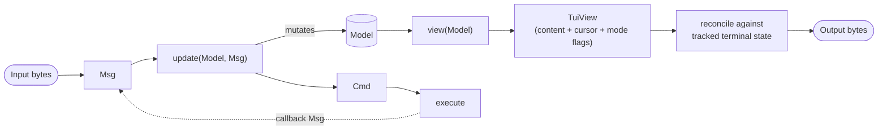

# bloom-boba

A C library for building terminal user interfaces. bloom-boba is the C
equivalent of Charm's three v2 projects rolled into a single library:
the [Bubbletea](https://github.com/charmbracelet/bubbletea) runtime,
the [Lipgloss](https://github.com/charmbracelet/lipgloss) style/layout
system, and the [Bubbles](https://github.com/charmbracelet/bubbles)
component collection. The shared spine is the
[Elm Architecture](https://guide.elm-lang.org/architecture/), translated
into idiomatic C.

The Charm ecosystem (now at [charm.land](https://charm.land)) has released a
[v2 generation](https://charm.land/blog/v2/) with an evolved API. bloom-boba
follows that direction: `view()` returns a `TuiView` that declares cursor
placement, alt-screen, mouse mode, keyboard enhancements, focus reporting,
bracketed paste, and window title each frame, and the runtime reconciles
against tracked terminal state. Focus is message-driven (`TUI_MSG_FOCUS` /
`TUI_MSG_BLUR`) and a Lipgloss-shaped `TuiStyle` covers colors, text
attributes, padding/margin, alignment, and borders. A handful of legacy
imperative setters remain marked `BLOOM_BOBA_DEPRECATED` with their
declarative replacements documented inline.

## Why "boba"?

The name pays homage to Bubbletea. Boba are the tapioca pearls in bubble tea.

## What bloom-boba Provides

bloom-boba has three parts:

**Runtime** (`TuiRuntime`) — The event loop that:

- Receives input and converts it to messages
- Calls your model's `update()` function
- Executes returned commands
- Calls `view()` to get a `TuiView` (content + terminal-mode declarations)
- Reconciles the requested terminal state and writes the next frame
- Repeats

**Style** (`TuiStyle`) — A Lipgloss-shaped, value-typed style record covering
colors (ANSI / 256 / truecolor / adaptive), text attributes, padding/margin,
alignment, and borders. Composable without mutation.

**Components** — Reusable UI building blocks:

- `textinput` — Text input with history, completion, Unicode support, multi-line editing, focus-aware styling
- `viewport` — Scrollable content area with software scrolling and tmux-style copy-mode
- `statusbar` — Status bar with mode indicator and notifications
- `textview` — Simple text display (for basic use cases)

## Philosophy

bloom-boba implements the [Elm Architecture](https://guide.elm-lang.org/architecture/),
a pattern for building interactive programs that emerged from the Elm programming
language. The architecture consists of three parts:

- **Model** — the state of your application
- **View** — a way to turn your state into terminal output
- **Update** — a way to update your state based on messages

Data flows in one direction:



This unidirectional flow makes programs predictable and easy to reason about.

## Adapting for C

Since C lacks garbage collection, sum types, and method chaining, bloom-boba
makes pragmatic choices:

- **Mutable models** — Update modifies the model in place rather than returning a copy
- **Tagged unions** — `TuiMsg` and `TuiCmd` use `enum` + `union` to simulate sum types
- **Explicit memory** — Components provide matching `*_create()` / `*_free()` functions
- **Declarative `TuiView`** — `view()` returns a small struct (content buffer +
  terminal-mode flags + cursor) that the runtime diffs against tracked state.
  This is the C analogue of returning a Bubbletea v2 `View` value.
- **Value-typed styles** — `TuiStyle` is a plain struct; setters take and
  return a value (`s = tui_style_bold(s, 1)`) instead of mutating, giving
  Lipgloss-style composition without method chains.

## Runtime

The runtime can be used in two modes:

**Bubbletea-style** — `tui_runtime_run()` owns the event loop, raw mode, and signal handling:

```c
TuiRuntime *rt = tui_runtime_create(&my_component, NULL, NULL);
tui_runtime_run(rt);  /* Blocks until quit */
tui_runtime_free(rt);
```

The runtime handles SIGWINCH (resize), SIGINT, stdin polling, and optional external FD
polling via `TuiRuntimeConfig` callbacks (`on_tick`, `on_resize`, `get_external_fd`,
`on_external_ready`, `on_stdin_processed`, `get_tick_timeout_ms`).

**Lower-level** — caller owns the event loop, drives the runtime manually:

```c
tui_runtime_start(rt);                        /* Enter raw mode */
tui_runtime_process_input(rt, buf, len);      /* Feed raw bytes */
tui_runtime_flush(rt);                        /* Render + write */
tui_runtime_stop(rt);                         /* Restore terminal */
```

### Message and Command Scheduling

External code (callbacks, signal handlers, other modules) can schedule work for the
event loop to process on its next iteration, following Bubbletea's `p.Send(msg)` pattern.

**Posting messages** — goes through the full Elm Architecture cycle (`update()` → command execution):

```c
/* From a callback, signal handler, or another thread's context */
TuiMsg msg = tui_msg_custom(MY_MSG_TYPE, my_data);
tui_runtime_post(rt, msg);  /* Wakes up select() immediately */
```

**Scheduling commands** — executed directly, bypassing `update()`:

```c
/* e.g. push something onto the system clipboard from a worker thread */
TuiCmd *cmd = tui_cmd_clipboard_copy(text, len);
tui_runtime_schedule(rt, cmd);  /* Runtime takes ownership */
```

When using `tui_runtime_run()`, queued items are drained automatically each iteration.
Use `tui_runtime_wakeup(rt)` to wake the event loop from `select()` when external state
changes and the tick timeout needs recomputing (thread-safe, async-signal-safe).

For lower-level usage where the caller owns the event loop, add the wakeup FD to your
`select()`/`poll()` and call `tui_runtime_drain()` when it becomes readable:

```c
int wakeup_fd = tui_runtime_wakeup_fd(rt);  /* -1 if unavailable */

/* In your select() loop: */
if (wakeup_fd >= 0)
    FD_SET(wakeup_fd, &read_fds);

/* After select() returns: */
if (wakeup_fd >= 0 && FD_ISSET(wakeup_fd, &read_fds)) {
    tui_runtime_drain(rt);
    tui_runtime_flush(rt);
}
```

## Example

```c
#include <bloom-boba/tui.h>

int main(void) {
    /* Initialize component */
    TuiTextInput *input = tui_textinput_create(NULL);

    /* Handle a key press */
    TuiMsg msg = tui_msg_key(0, 'H', 0);
    tui_textinput_update(input, msg);

    /* Render */
    DynamicBuffer *out = dynamic_buffer_create(256);
    tui_textinput_view(input, out);
    printf("%s", dynamic_buffer_data(out));

    /* Cleanup */
    tui_textinput_free(input);
    dynamic_buffer_destroy(out);
    return 0;
}
```

## Component Interface

The component interface follows the Elm Architecture pattern:

```c
typedef struct TuiComponent {
  TuiInitResult (*init)(void *config);                          /* Create model + initial command */
  TuiUpdateResult (*update)(TuiModel *model, TuiMsg msg);        /* Handle message */
  TuiView (*view)(const TuiModel *model, DynamicBuffer *out);    /* Render content + declare modes */
  void (*free)(TuiModel *model);                                 /* Cleanup */
} TuiComponent;
```

`view()` writes content bytes to `out` and returns a `TuiView` describing the
desired terminal state for the frame:

```c
typedef struct TuiView {
  DynamicBuffer *layer;                     /* Rendered content (== out) */
  int alt_screen;                            /* 1 = alternate screen */
  TuiMouseMode mouse_mode;                   /* NONE / CELL_MOTION / ALL_MOTION */
  TuiKeyboardEnhancements kbd_enhancements;  /* Kitty keyboard protocol bitmask */
  int report_focus;                          /* 1 = enable focus events */
  int bracketed_paste;                       /* 1 = enable bracketed paste */
  const char *window_title;                  /* NULL = leave alone */
  TuiCursor cursor;                          /* visible=0 = hidden */
} TuiView;
```

The runtime diffs each frame's `TuiView` against the terminal state it tracks
and emits only the bytes needed to reach the requested state — no imperative
"enter alt screen" / "show cursor" commands. Use `tui_view_default(out)` to
start with everything off, set the fields you care about, and return the
struct. Set `cursor.visible = 0` (or use `tui_cursor_hidden()`) to keep the
cursor hidden for that frame.

### Init returns (Model, Cmd)

Following Elm's `init : () -> (Model, Cmd Msg)`, the init function returns both
a model and an optional initial command:

```c
typedef struct {
  TuiModel *model;  /* Initialized model */
  TuiCmd *cmd;      /* Initial command (NULL for none) */
} TuiInitResult;
```

This allows components to trigger effects at startup (e.g., start a timer,
fetch initial data).

## Messages and Commands

### Message Types

Messages represent events flowing into the update function:

| Type                                                          | Description                                            |
| ------------------------------------------------------------- | ------------------------------------------------------ |
| `TUI_MSG_KEY_PRESS`                                           | Key press with modifiers (Ctrl, Alt, Shift, Meta)      |
| `TUI_MSG_MOUSE`                                               | Mouse button/wheel/motion with SGR coordinates         |
| `TUI_MSG_WINDOW_SIZE`                                         | Terminal resized                                       |
| `TUI_MSG_FOCUS` / `TUI_MSG_BLUR`                              | Focus state — dispatched by parents to children        |
| `TUI_MSG_PASTE_START` / `TUI_MSG_PASTE` / `TUI_MSG_PASTE_END` | Bracketed paste (opt in via `TuiView.bracketed_paste`) |
| `TUI_MSG_LINE_SUBMIT`                                         | Line submitted from text input                         |
| `TUI_MSG_EOF`                                                 | End of input (Ctrl+D on empty line)                    |
| `TUI_MSG_CUSTOM_BASE`                                         | Base value for application-defined messages            |

### Command Types

Commands represent effects returned from the update function:

| Type                     | Description                                     |
| ------------------------ | ----------------------------------------------- |
| `TUI_CMD_NONE`           | No-op (returned by helpers when no work needed) |
| `TUI_CMD_QUIT`           | Exit the application                            |
| `TUI_CMD_BATCH`          | Run multiple commands                           |
| `TUI_CMD_LINE_SUBMIT`    | Line submitted (contains text)                  |
| `TUI_CMD_TAB_COMPLETE`   | Tab completion request (prefix + word position) |
| `TUI_CMD_CLIPBOARD_COPY` | Copy text to system clipboard (OSC 52)          |
| `TUI_CMD_CUSTOM_BASE`    | Base value for application-defined commands     |

Terminal-mode toggles (alt screen, mouse, keyboard enhancements, cursor
visibility, focus reporting, bracketed paste, window title) are no longer
commands — declare them on the `TuiView` returned from `view()` and the
runtime reconciles each frame.

## Components

### textinput

A text input field with Emacs-style editing, similar to an HTML `<input type="text">` but with advanced terminal capabilities.

Features:

- **Multi-line support** - Toggle between single-line and multi-line text areas
- **Unicode/UTF-8 support** - Full international character handling with proper cursor positioning
- **Emacs keybindings** - Ctrl+A/E (line start/end), Ctrl+B/F (char movement), Ctrl+P/N (history/line navigation), Ctrl+K/U/W (kill), Ctrl+Y (yank), Ctrl+T (transpose), **Ctrl+Space** (set/toggle mark), **Alt+w** (copy region or whole input), **Ctrl+G / Esc** (clear mark)
- **Selection** - `C-SPC` sets a mark; the active region (between mark and cursor) is rendered with `SGR_REVERSE`. Motion extends the selection; any edit clears it.
- **System clipboard** - Both `Alt+w` and every kill (`Ctrl+K/U/W`) emit `TUI_CMD_CLIPBOARD_COPY`, going through the runtime's OSC 52 default or `clipboard_handler` override (see the [Clipboard](#clipboard) section). Matches graphical emacs's `interprogram-cut-function = gui-select-text` default — every cut is also a copy.
- **Command history** - Up/down navigation with saved current input
- **Tab completion** - Emits `TUI_CMD_TAB_COMPLETE` with prefix and word position
- **Kill ring** - Consecutive kills append to the same buffer (also reflected in the clipboard cmd as the kill ring grows)
- **Undo** - Multiple undo levels with Ctrl+\_ or Ctrl+X Ctrl+U
- **Absolute cursor positioning** - Flicker-free rendering at a parent-supplied row
- **Prompt support** - Custom prompt strings with proper UTF-8 width calculation
- **Configurable word characters** - Whitelist-based word boundaries for completion and movement
- **Echo mode** - Password masking (shows `*` per codepoint)
- **Focus-aware styling** - Separate focused / blurred `TuiStyle` for the prompt (Bubbles parity)
- **Continuation prompt** - Custom prompt for lines after the first in multi-line mode

For decorative horizontal lines above or below the input, parents
compose `tui_border_render_horizontal()` (see [Styles](#styles)) — the
textinput renders only the input line(s).

```c
TuiTextInput *input = tui_textinput_create(NULL);
tui_textinput_set_prompt(input, "> ");
tui_textinput_set_history_size(input, 100);
tui_textinput_set_terminal_row(input, 23);     /* Absolute positioning */
tui_textinput_set_word_chars(input, "abc..."); /* Word boundary chars */
tui_textinput_set_echo_mode(input, 1);         /* Password masking */

/* Lipgloss-shaped focus-aware prompt styling */
TuiStyle pink = tui_style_foreground(tui_style_new(), tui_color_hex("#ff06b7"));
TuiStyle dim  = tui_style_faint(tui_style_new(), 1);
tui_textinput_set_focused_prompt_style(input, pink);
tui_textinput_set_blurred_prompt_style(input, dim);
```

### viewport

A sophisticated scrollable content area that stores lines in memory and renders with absolute cursor positioning. This is the recommended component for displaying scrollable output (like a terminal's main content area) with advanced features.

Features:

- **Software-based scrolling** - No ANSI scroll regions for maximum compatibility
- **Line storage** - Configurable maximum line count with automatic trimming
- **Auto-scroll** - Automatically scrolls to bottom when new content is added (optional)
- **Manual scrolling** - Scroll up/down/page commands with proper boundary checking
- **Wrap/clip modes** - Choose between line wrapping or truncation at viewport width
- **ANSI sequence support** - Proper handling of VT100/ANSI color codes and SGR sequences
- **UTF-8 aware** - Correct display width calculation for international characters
- **Memory efficient** - Automatic cleanup of old lines when exceeding maximum
- **Visual line calculation** - Handles long lines that wrap across multiple screen rows
- **State preservation** - Maintains ANSI SGR state across wrapped line segments
- **Copy-mode (tmux-style)** - When focused, `C-SPC` enters a navigation mode with cursor + mark in scrollback coordinates, so selections can extend across content scrolled off the visible window. Emacs keybindings: `C-n/p/f/b/a/e`, arrow keys, `Home/End`, `C-v`/`M-v` page, `M-<`/`M->` top/bottom, `M-w` copy, `C-g`/`Esc` cancel
- **Selection rendering** - Selected range overlaid with `SGR_REVERSE` while preserving existing per-line SGR state
- **Mouse selection** - Left-click + drag selects (entering copy-mode automatically); drag past the top/bottom edge autoscrolls; mouse wheel scrolls without disturbing the selection
- **System clipboard** - `M-w` returns a `TUI_CMD_CLIPBOARD_COPY` command; the runtime emits OSC 52 by default or calls a user-provided handler (see "Clipboard" below)

```c
TuiViewport *vp = tui_viewport_create();
tui_viewport_set_size(vp, 80, 20);
tui_viewport_set_render_position(vp, 1, 1);  /* Start at row 1, col 1 */
tui_viewport_set_max_lines(vp, 1000);        /* Limit memory usage */
tui_viewport_set_wrap_mode(vp, 1);           /* Enable line wrapping */
tui_viewport_append(vp, "Hello, world!\n", 14);

/* Enable copy-mode: the parent decides who is focused and dispatches
 * TUI_MSG_FOCUS / TUI_MSG_BLUR through the viewport's update path. */
tui_viewport_component()->update((TuiModel *)vp, tui_msg_focus());

/* Hit-test for routing mouse events from a parent component: */
if (tui_viewport_contains(vp, mouse_row, mouse_col)) {
    /* forward the mouse event to the viewport */
}
```

### textview

A simple text buffer for basic text display. Use `viewport` instead for scrollable content with software scrolling, ANSI sequence support, and advanced features like line wrapping and memory management.

Features:

- **Basic text storage** - Simple buffer for accumulating text content
- **Auto-scroll** - Option to automatically reset scroll position on new content
- **Direct output** - Write directly to terminal for live output scenarios
- **Minimal overhead** - Lightweight alternative for simple display needs

```c
TuiTextView *view = tui_textview_create(10);
tui_textview_append_str(view, "Simple text output\n");
tui_textview_write_direct(view, "Live output", 11);
```

### statusbar

A single-line status bar with a mode indicator on the left and notification text on the right.

Features:

- **Mode indicator** - Persistent left-aligned text (e.g., current mode or state)
- **Notifications** - Transient right-aligned text
- **Absolute cursor positioning** - Positioned at a specific terminal row
- **UTF-8 aware** - Correct display width calculation for alignment

```c
TuiStatusBar *sb = tui_statusbar_create();
tui_statusbar_set_terminal_width(sb, 80);
tui_statusbar_set_terminal_row(sb, 24);
tui_statusbar_set_mode(sb, "NORMAL");
tui_statusbar_set_notification(sb, "Connected");
```

## Clipboard

Components emit `TUI_CMD_CLIPBOARD_COPY` (e.g., the viewport's `M-w` in copy-mode). The runtime handles it in one of two ways:

- **Default — OSC 52** (`ESC ] 52 ; c ; <base64> ESC \`): the bytes are written to the configured output. Modern terminals (kitty, alacritty, wezterm, iTerm2, foot, ghostty, recent xterm) honor this and push to the system clipboard. VTE-based terminals (GNOME Terminal, XFCE Terminal, Terminator) silently drop it.
- **App-supplied handler**: install `clipboard_handler` on `TuiRuntimeConfig` to override (e.g., shell out to `xclip` / `wl-copy` / `pbcopy` on terminals that don't support OSC 52). When set, the runtime calls the handler instead of emitting OSC 52.

```c
static void my_clipboard_copy(const char *text, size_t len, void *user_data) {
    /* Pipe to xclip, wl-copy, pbcopy, or store somewhere else. */
}

TuiRuntimeConfig cfg = { 0 };
cfg.clipboard_handler = my_clipboard_copy;
TuiRuntime *rt = tui_runtime_create(&my_component, NULL, &cfg);
```

Apps can also emit the command directly:

```c
return tui_update_result(tui_cmd_clipboard_copy(text, len));
```

## Styles

`TuiStyle` is bloom-boba's Lipgloss equivalent: a value-typed style record
covering colors, text attributes, padding/margin, alignment, and borders.
Setters take and return a `TuiStyle` so styles compose without mutation:

```c
TuiStyle title = tui_style_padding_x(
    tui_style_bold(
        tui_style_foreground(tui_style_new(),
                             tui_color_hex("#ff06b7")),
        1),
    1);

DynamicBuffer *out = dynamic_buffer_create(64);
tui_style_render(&title, "Hello, world", out);
```

Colors come from `tui_color_ansi(n)` (16-color), `tui_color_rgb(r,g,b)`,
`tui_color_hex("#rrggbb")`, or `tui_color_adaptive(light, dark)` (picks the
right one based on detected background). Borders ship as five prefab
`TuiBorder` styles (normal, rounded, thick, double, hidden). Use
`tui_style_get_width()` / `tui_style_get_height()` to measure rendered
content without producing the bytes.

For single horizontal-line dividers — the lipgloss
`strings.Repeat(border.Top, n)` styled idiom, used when you want a
decorative line above or below another component rather than a full
4-sided box — use `tui_border_render_horizontal()`. It tiles the chosen
edge across the requested width, applies a `TuiStyle` inline, and
optionally embeds a title at left/center/right alignment (bloom-boba's
small extension over lipgloss, which has no built-in title-in-border
API):

```c
char *line = tui_border_render_horizontal(
    &TUI_BORDER_NORMAL, /* top= */ 1, /* width= */ 80,
    &my_dim_style,
    /* title= */ "Session", TUI_BORDER_TITLE_CENTER,
    /* pad_left= */ 1, /* pad_right= */ 1);
/* position cursor with CSI <row>;1H, write line, free(line) */
```

The textinput component consumes `TuiStyle` values directly via
`tui_textinput_set_focused_prompt_style()` and friends; the same shape is
how user code is expected to style its own components.

## Component Composition

bloom-boba follows the same composition pattern as Bubbletea:
the runtime manages ONE model, and composition happens inside that model.

### Embedding Child Components

A parent component embeds children as struct fields:

```c
typedef struct {
  TuiModel base;           /* Component base type */
  TuiViewport *viewport;   /* Child: scrollable output */
  TuiTextInput *textinput; /* Child: user input */
} MyAppModel;
```

### Routing Messages

The parent's update function routes messages to children:

```c
TuiUpdateResult my_app_update(MyAppModel *app, TuiMsg msg) {
  /* Handle window resize at parent level */
  if (msg.type == TUI_MSG_WINDOW_SIZE) {
    tui_viewport_set_size(app->viewport,
        msg.data.size.width, msg.data.size.height - 3);
    return tui_update_result_none();
  }

  /* Route key messages to focused child */
  if (msg.type == TUI_MSG_KEY_PRESS) {
    return tui_textinput_update(app->textinput, msg);
  }

  return tui_update_result_none();
}
```

### Composing Views

The parent's view function writes children's content into `out` and
returns a `TuiView` carrying the desired terminal-mode declarations:

```c
TuiView my_app_view(const TuiModel *m, DynamicBuffer *out) {
  const MyAppModel *app = (const MyAppModel *)m;

  /* Children render via absolute positioning into `out` */
  tui_viewport_view(app->viewport, out);
  tui_textinput_view(app->textinput, out);

  /* Parent declares terminal state for the frame */
  TuiView v = tui_view_default(out);
  v.bracketed_paste = 1;
  v.cursor = tui_textinput_cursor_pos(app->textinput);
  return v;
}
```

### Composing Cursor Across Multiple Focusable Children

`tui_textinput_cursor_pos()` and `tui_viewport_cursor_pos()` return
`tui_cursor_hidden()` when the child is unfocused, so for two-pane layouts
the focused child's cursor naturally wins:

```c
TuiCursor pick_cursor(const MyAppModel *app) {
  return app->focus_idx == 0
      ? tui_textinput_cursor_pos(app->input)
      : tui_viewport_cursor_pos(app->viewport);
}
```

### Batching Commands

When children return commands, use `tui_cmd_batch2` to combine them:

```c
TuiCmd *cmd1 = child1_result.cmd;
TuiCmd *cmd2 = child2_result.cmd;
TuiCmd *combined = tui_cmd_batch2(cmd1, cmd2);  /* Handles NULL gracefully */
return tui_update_result(combined);
```

### Focus

Like Bubbletea's `examples/textinputs`, focus is owned by the parent. There is no library-side focus router — the parent tracks which child is active and dispatches `TUI_MSG_FOCUS` / `TUI_MSG_BLUR` when focus moves. Components that care about focus (`textinput`, `viewport`) update their own `focused` flag in response.

```c
typedef struct {
    TuiModel base;
    TuiTextInput *input;
    TuiViewport *viewport;
    int focus_idx;  /* 0 = input, 1 = viewport */
} App;

static void cycle_focus(App *app, int dir) {
    /* Tell the previously focused child it lost focus. */
    if (app->focus_idx == 0)
        tui_textinput_update(app->input, tui_msg_blur());
    else
        tui_viewport_component()->update((TuiModel *)app->viewport, tui_msg_blur());

    app->focus_idx = (app->focus_idx + dir + 2) % 2;

    /* And tell the new one it gained focus. */
    if (app->focus_idx == 0)
        tui_textinput_update(app->input, tui_msg_focus());
    else
        tui_viewport_component()->update((TuiModel *)app->viewport, tui_msg_focus());
}

/* In the parent's update: cycle on Tab / Shift+Tab. */
if (msg.type == TUI_MSG_KEY_PRESS && msg.data.key.key == TUI_KEY_TAB) {
    cycle_focus(app, (msg.data.key.mods & TUI_MOD_SHIFT) ? -1 : +1);
    return tui_update_result_none();
}
```

The parser produces Shift+Tab as `{TUI_KEY_TAB, mods: TUI_MOD_SHIFT}` (xterm `CSI Z` and the kitty keyboard protocol), and Ctrl+Space as `{rune: ' ', mods: TUI_MOD_CTRL}`.

## How bloom-boba Adapts the Elm Architecture

### Software Scrolling

Terminals offer ANSI scroll regions (DECSTBM) for hardware-assisted scrolling, but
bloom-boba's viewport redraws content with absolute cursor positioning instead. This
follows Bubbletea's approach. ANSI scroll regions behave inconsistently across
terminal emulators — cursor positioning at region boundaries causes visual glitches,
and the host terminal controls what happens in the scrollback buffer. Software
scrolling avoids all of this: the viewport owns every pixel it draws, wrapping,
clipping, and scroll position are just arithmetic on an in-memory line buffer.

### Commands and TuiView

In Elm, commands are opaque values the runtime interprets. bloom-boba splits
"things that happen" into two channels: discrete one-shot effects flow as
`TuiCmd` values returned from `update()` (`TUI_CMD_QUIT`, `TUI_CMD_LINE_SUBMIT`,
`TUI_CMD_CLIPBOARD_COPY`, etc.) and the runtime switches over the tag, while
ongoing terminal state (alt screen, mouse, keyboard enhancements, cursor,
focus reporting, bracketed paste, window title) is declared per frame on the
`TuiView` returned from `view()`. The runtime tracks current terminal state
and emits only the bytes needed to reach the requested state, the same way
Bubbletea v2 reconciles its `View`. Application-defined custom commands add a
callback, because that is the simplest way for application code to define
arbitrary effects without the runtime needing to know about them in advance.

### Subscriptions

Elm's `subscriptions : Model -> Sub Msg` lets a program declaratively describe
ongoing event sources that change based on model state — subscribe to a WebSocket
only when connected, start a timer only in a certain mode. bloom-boba covers the
same use cases through runtime config callbacks:

| Elm subscription               | bloom-boba equivalent                                            |
| ------------------------------ | ---------------------------------------------------------------- |
| `Time.every 1000 Tick`         | `on_tick` + `get_tick_timeout_ms`                                |
| Window resize                  | Automatic `TUI_MSG_WINDOW_SIZE` + `on_resize`                    |
| Ports / external event sources | `get_external_fd` + `on_external_ready`                          |
| Post-input hooks               | `on_stdin_processed`                                             |
| Any external source            | `tui_runtime_post()` from callbacks, threads, or signal handlers |

Two properties of terminal programs make this a good fit:

- **Event sources are static.** A terminal program listens to stdin, signals, and
  maybe one external FD. These don't change based on model state, so a config struct
  set once at startup matches the reality better than a function re-evaluated after
  every update.

- **C already has event loop primitives.** Callbacks compose directly with
  `select()`/`poll()`, signal handlers, and threads. A declarative subscription
  layer would need an interpreter that adds indirection without adding
  expressiveness for these use cases.

### Input Parsing

The input parser (`TuiInputParser`) converts raw terminal bytes into typed messages:

- ANSI CSI sequences (cursor keys, function keys, modifiers)
- SS3 sequences (alternate cursor encoding)
- SGR extended mouse sequences (`CSI < Cb;Cx;Cy M/m`)
- Kitty keyboard protocol (`CSI keycode;modifiers u`)
- UTF-8 multi-byte sequences
- Control characters with modifier detection

## Building

### Dependencies

Required:

- `gcc` — C compiler
- `autoconf` — Generate configure scripts
- `automake` — Generate Makefile.in files
- `make` — Build system

Optional (for development):

- `bear` — Generate `compile_commands.json` for clang tooling
- `clang-tools-extra` — Provides `clang-format` for code formatting
- `shfmt` — Shell script formatting
- `prettier` — Markdown formatting

On Fedora 41+:

```bash
sudo dnf install gcc autoconf automake make
sudo dnf install bear clang-tools-extra shfmt   # optional
```

### Build Commands

Pure GNU Autotools — no wrapper script. From a clean checkout:

```bash
./autogen.sh
mkdir build && cd build
../configure --prefix=$HOME/.local --enable-debug
make -j$(nproc)
make check          # run the test suite
make install        # install library + headers + pkg-config file
```

Useful targets, all run from `build/`:

- `make` — build `libbloom-boba.a`
- `make check` — run the test suite (folds in tmux end-to-end tests when tmux is detected)
- `make install` — install to `--prefix`
- `make format` — clang-format on C sources, shfmt on shell, prettier on Markdown
- `make bear` — produce `compile_commands.json` for clangd

Release build: omit `--enable-debug` and pass `CFLAGS="-O2 -DNDEBUG"` to `configure`.

Output: `build/src/libbloom-boba.a` (static library). After `make install`, use
pkg-config to get the correct flags:

```bash
gcc -o myapp myapp.c $(pkg-config --cflags --libs bloom-boba)
```

## Testing

`make check` runs both suites in one go:

```bash
cd build && make check
```

### Unit tests

Fast, hermetic state-based tests under `tests/`. Each test binary links `libbloom-boba.a`, constructs a component directly, drives it with messages, and asserts on internal state.

### Terminal end-to-end tests

Purpose-built mini-apps that run inside a real `tmux` session. A bash driver sends keystrokes with `tmux send-keys`, captures the visible grid via `tmux capture-pane -p`, and inspects the cursor with `tmux display-message -p '#{cursor_x}'`. This catches rendering regressions that unit tests miss — e.g., a malformed CSI sequence, off-by-one cursor positioning, or content overflowing the visible area.

These tests are folded into `make check` automatically when `tmux` is on `PATH` at configure time. If `tmux` is absent, the unit-test suite still runs and the tmux scripts are simply not registered with automake.

#### Layout

```
tests/
├── apps/                       # mini-apps (one per scenario)
│   ├── tmux_textinput_multi.c
│   └── tmux_focus_swap.c
└── tmux/
    ├── lib.sh                  # bash helpers
    ├── scroll_multiline.sh
    └── focus_shift_tab.sh
```

A mini-app is a few dozen lines of C that wraps a component, handles `TUI_MSG_WINDOW_SIZE` to call the relevant `set_terminal_width`, and calls `tui_runtime_run()`. No quit key is needed — the driver tears down with `tmux kill-session`.

`lib.sh` exposes `tmux_start`, `tmux_send`, `tmux_capture`, `tmux_cursor`, `tmux_kill`, `tmux_wait_for`, `dump_pane`, `assert_pane_contains`, `assert_pane_lacks`, and `assert_cursor_x_lt`.

#### Adding a new tmux test

1. Write `tests/apps/foo.c`.
2. Register the binary under `if HAVE_TMUX` in `tests/Makefile.am`:

   ```makefile
   check_PROGRAMS += apps/foo
   apps_foo_SOURCES = apps/foo.c
   ```

3. Write `tests/tmux/foo.sh`. Source `lib.sh`, launch the mini-app with `tmux_start`, drive it, assert.
4. Append the script to `TMUX_TESTS` in `tests/Makefile.am`.

Two patterns worth reusing from `scroll_multiline.sh`:

- **Sentinel sync**: append a unique character to a `send-keys` batch, then `tmux_wait_for` it. Confirms every keystroke was processed before assertions run.
- **Cleanup trap**: `trap 'tmux_kill "$SESSION"' EXIT` always fires, even on assertion failure. `tmux_start` enables `remain-on-exit` so a crashed mini-app leaves a debuggable pane — pair with `dump_pane` in failure paths.

## Contributing

See [AUTHORS](AUTHORS) for the list of contributors.

This project is licensed under the [MIT License](COPYING).
